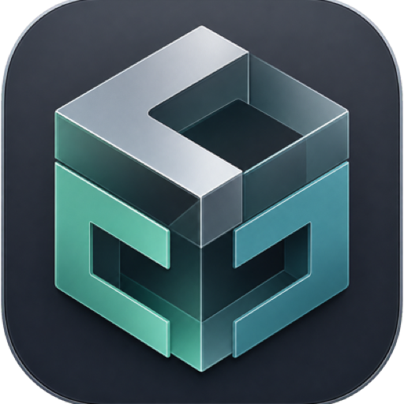
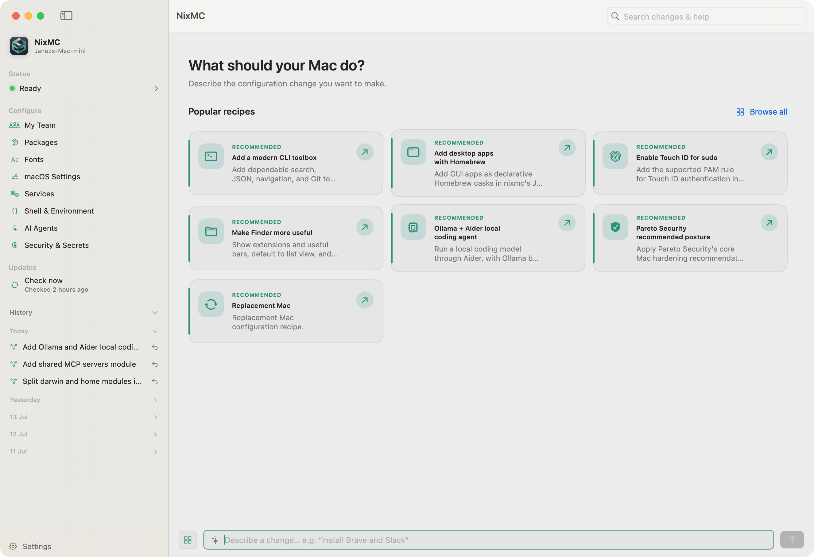
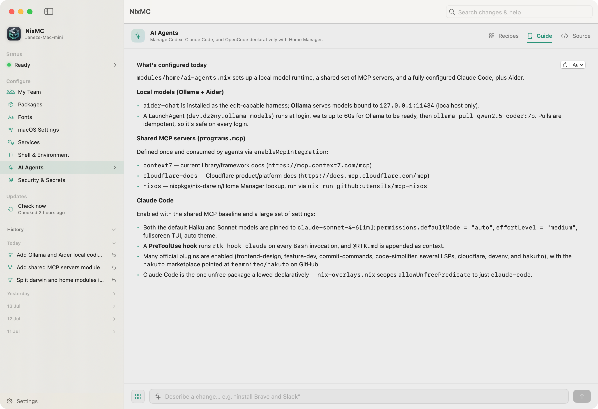

<p align="center">
  
</p>

<h1 align="center">NixMC</h1>

<p align="center">
  Manage your Mac by describing the change you want.
</p>

<p align="center">
  
  
  
</p>

NixMC is a native macOS app for managing a nix-darwin configuration with
Claude Code or Codex CLI. Ask it to install an app, change a macOS setting,
configure your shell, enable a service, or update your packages. nixmc prepares
the edit, validates the configuration, and shows you the diff before anything
is applied.

**My Team** turns a Git repository of Markdown recipes into a shared, curated
catalog for everyone on the team. Connect it once in the app and nixmc fetches
the latest recipes without mixing them into your personal configuration repo.

## Screenshots

<p align="center">
  
</p>

<p align="center">
  
</p>

## Why NixMC exists

NixMC started as a way to share useful Mac configuration with coworkers without
asking everyone to give up the aliases, tools, and muscle memory that make their
own setup work. Recipes turn a configuration into searchable, living
documentation: you can find what an alias does, reuse a proven choice, or adapt
it to a different workflow. Updates are isolated into reviewable proposals, so
keeping a workstation current never quietly changes the configuration you rely
on every day.

## Highlights

- Plain-English changes to apps, tools, services, fonts, shell, and macOS settings
- Build validation and a complete diff before activation
- Claude Code and Codex CLI support with a selectable preferred agent
- **My Team:** a separately managed Git-backed recipe catalog your whole team can share
- Git-backed history with inspect and rollback actions
- Plain-English guides generated from the configuration currently in use
- Source-backed recipes with Nix and shell examples for common macOS changes
- Pareto Security recommended-posture recipe for declarative Mac hardening
- Replacement Mac recipe to capture and reproduce a setup on a new machine
- Background flake-update proposals that wait for your approval

## Feature Overview

| Area | What you get |
|---|---|
| Apps & CLI tools | Add or remove Homebrew casks and formulae from one package browser |
| macOS configuration | Manage defaults, fonts, services, security, and system behavior |
| Mac security | Apply Pareto Security's recommended posture without weakening macOS protections |
| New Mac setup | Use the Replacement Mac recipe to capture a setup and reproduce it on the next Mac |
| Agent workflow | Describe a result and let the selected coding agent prepare the edit |
| My Team | Fetch a hand-curated Git repository of shared recipes, refreshed hourly and on demand |
| Review & apply | Format, build, inspect the diff, then activate with administrator approval |
| Configuration guide | Browse a readable explanation of what each configuration area does today |
| Updates | Check flake inputs automatically and review isolated update proposals |
| History | Inspect applied changes and roll back an earlier Git commit |
| Appearance | Choose light, dark, or system appearance and a preferred accent palette |

## How It Works

1. Describe the result you want or choose a recipe.
2. The selected agent edits the configuration repository.
3. nixmc formats and builds the configuration.
4. Review the generated diff and build output.
5. Apply the change; nixmc activates it and records it in Git.

The agent runs non-interactively with permission to edit the configuration.
Always review the proposed diff before applying it.

### Secure a Mac with Pareto Security

macOS hardening is easy to get wrong when settings are spread across System
Settings, command-line tools, and undocumented defaults. Choose **Pareto
Security recommended posture** from the Security & Secrets recipes to apply the
core recommendations declaratively: firewall and stealth mode, screen locking,
software updates, AirDrop discovery, and the security-sensitive sharing
services. The recipe keeps macOS protections intact, includes the Pareto
Security cask, and leaves any change visible in the normal build-and-diff
review before it is applied.

### Move to a new Mac

Your configuration is a Git repository, so it can travel with you. Use the
**Replacement Mac** recipe to capture non-default macOS settings, Homebrew
apps, shell tools, and launch agents in the flake. On the new Mac, clone that
same repository during first run, build it, review the diff, and apply it to
recreate the setup you chose—without having to remember every preference or
rebuild it from one-off setup commands.

## Built For

- People who want the reproducibility of nix-darwin without editing every Nix option by hand
- Mac users who prefer reviewing a concrete diff over running one-off setup commands
- Existing Nix users who want a focused interface for daily configuration changes

## Requirements

- macOS 14 or newer
- An administrator account on the Mac
- [Claude Code](https://code.claude.com/docs) available on your shell path, or
  [Codex CLI](https://developers.openai.com/codex/cli/) installed at
  `~/.local/bin/codex`
- The selected coding agent signed in before nixmc is opened

Install Nix yourself before first use. NixMC links to Determinate's graphical
installer for the familiar roughly five-minute macOS setup, but never downloads
or runs an installer on your behalf. It uses the agent CLI already installed on
the Mac, so no AI API key is entered into NixMC.

## Install

Check [Releases](https://github.com/dz0ny/nixmc/releases) for a signed
`nixmc.dmg`. Open the disk image and move `nixmc.app` to Applications.

Once installed, NixMC keeps itself up to date: it checks Releases in the
background, verifies a downloaded update is signed by the same Developer ID
before installing it, and offers **Install and Relaunch** in Settings →
Updates (toggle the automatic check off there if you prefer).

If no signed release is listed, build the current version locally:

```bash
git clone https://github.com/dz0ny/nixmc.git
cd nixmc
make app
open dist/nixmc.app
```

## First Run

1. If prompted, install Nix with the linked graphical installer, then return to NixMC and choose **Check Again**.
2. Create the initial nix-darwin configuration, or clone an existing remote dotfiles repository that contains `flake.nix`.
3. Open **Settings > General** and choose Claude Code or Codex CLI.
4. Describe a change in the message field or choose a recipe.
5. Review the diff and build result, then select **Apply**.

Initial setup asks for administrator approval to create the canonical
`/etc/nix-darwin` link. Applying system changes also requires administrator
approval.

## Initial Template, Updates, and Configuration

Creating a configuration starts from nixmc's small nix-darwin + Home Manager
template. It tracks `nixpkgs-unstable` intentionally: a Mac workstation needs
current applications, developer tools, and macOS support more often than a
long-lived server does. This does not make each build unpinned—the generated
`flake.lock` records the exact revisions in use, so a known configuration can
always be reproduced. `nix-darwin` and Home Manager follow that same pinned
`nixpkgs` revision.

nixmc updates those pins as a reviewable change. When automatic update checks
are enabled (or when you check manually), it creates an isolated Git worktree,
runs `nix flake update`, commits the resulting lock-file change, and verifies
it with `darwin-rebuild build`. It then presents the diff as an update proposal.
Choosing **Stage for review** stages that proposal in your configuration repository; you
still review the diff and use **Build & Apply** to activate it. Dismissing a
proposal leaves your live configuration untouched.

There is one supported source of configuration: the single Git-backed flake
that nixmc manages. New configurations live at `~/.config/nixmc/darwin`, with
`/etc/nix-darwin` linked to it; if you already have a flake at
`/etc/nix-darwin`, nixmc uses that repository instead. Make system, user, and
Homebrew changes in this one repository through nixmc so the build, diff,
history, rollback, and update workflow all describe the same machine. Do not
maintain a second nix-darwin configuration alongside it.

## Permissions

| Permission | Why it is needed |
|---|---|
| Administrator approval | Create `/etc/nix-darwin` and activate system changes |
| App Management | Allow Homebrew to update managed app bundles in `/Applications` |

If apply fails with `Operation not permitted` while processing an app bundle,
open **System Settings > Privacy & Security > App Management**, allow nixmc,
then apply again.

## Configuration & History

The Git-backed configuration lives at:

```text
~/.config/nixmc/darwin
```

Homebrew packages are declared in:

```text
~/.config/nixmc/darwin/.nixmc/homebrew/data.json
```

Applied changes are committed automatically so the History section can show
diffs and roll back earlier changes.

## Recipes

### My Team: shared recipes

Open **My Team** in the sidebar and paste a GitHub repository URL. nixmc keeps
an independent shallow checkout at `~/.nixmc/team-recipes`, fetches it hourly,
and refreshes it when the page is opened. This catalog is intentionally kept
outside `~/.config/nixmc/darwin`, so team recipe updates never alter your
configuration history.

Put recipe Markdown anywhere in that repository. Use descriptive file names
and include `title`, `section`, and `summary` front matter; the app discovers
files recursively and groups all of them under **My Team**. Start from the
[example recipe](https://github.com/dz0ny/nixmc/blob/main/Sources/nixmc/Resources/recipes/ai-agents/codex.md).

A root-level `GUIDE.md` is also supported. nixmc displays that team-authored
guide verbatim in the **My Team > Guide** tab and includes it in global search.

### Built-in recipes

Built-in recipes live under
`Sources/nixmc/Resources/recipes/<section>/<title>.md`. They are bundled with
the app and grouped by the same areas shown in the sidebar. The front matter
drives the UI; the Markdown body is passed to the selected agent and may contain
exact Nix snippets, shell commands, or a focused diff.

To include durable human documentation, add a `## Guide` section after the
recipe body. NixMC never sends that section to the agent. After a successful
apply, it copies the Markdown verbatim into the configuration repository's
ignored `.nixmc/recipe-guides/` folder and appends it to the recipe's matching
section in the tracked `GUIDE.md`. This keeps the final guide shareable while
preserving the human-authored source whenever NixMC refreshes generated guide
content.

Recipe pull requests are welcome in
[the recipes folder](https://github.com/dz0ny/nixmc/tree/main/Sources/nixmc/Resources/recipes),
especially for well-tested macOS, nix-darwin, and Home Manager workflows with a
source link and a concise guide section.

~~~~md
---
id: touch-id-sudo
title: Enable Touch ID for sudo
section: Security & Secrets
symbol: touchid
summary: Add the supported PAM rule for Touch ID authentication in Terminal.
featured: true
source: https://github.com/nix-darwin/nix-darwin
---

```nix
security.pam.services.sudo_local.touchIdAuth = true;
```
~~~~
